# 3 types of vm Creation
1. availability zone
2. vm scaleset vmss (autoscaling)
3. vm Availability set
4. inbound outbound port nsg (network security Group)
5. Application Security group

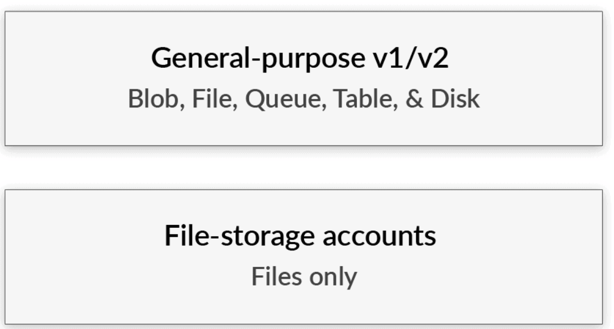

resource group create

Availability center

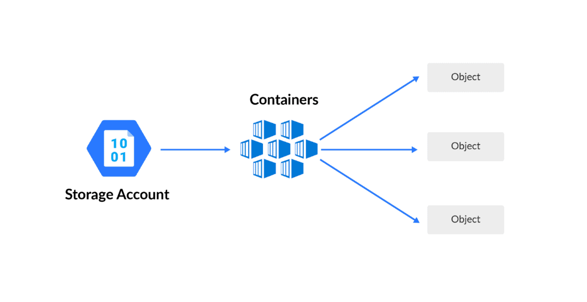

region contains one more data center
Region pair

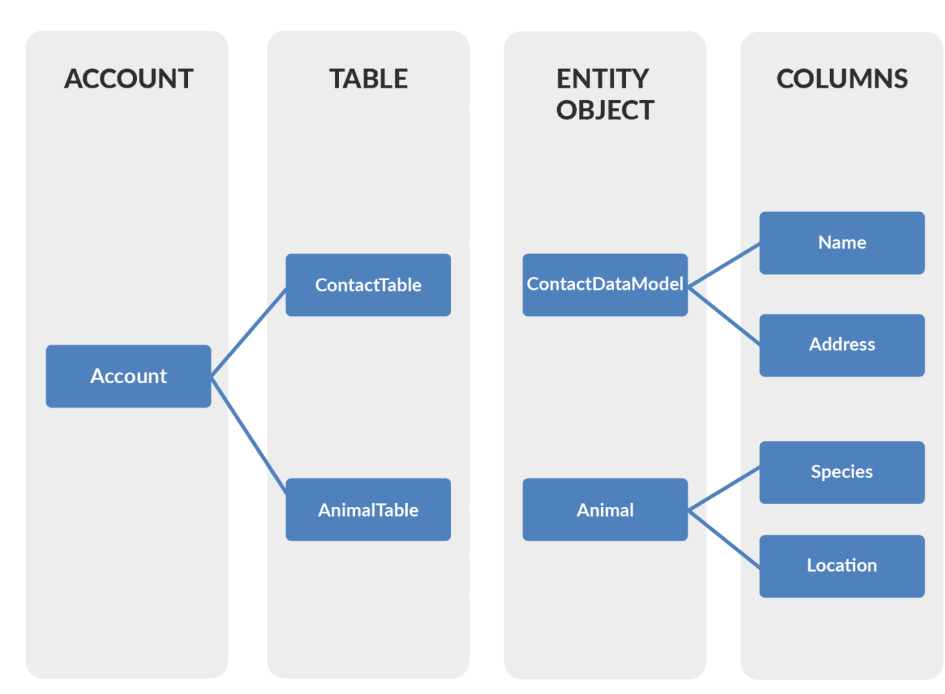
vm ss ==>Autoscaling

at peektime (seasonal sale) we get more request in that we should allow all request at a time. it will create an instance automatically

instance ==> ex:vm ==>
50 request
100 request ==>split into 2 ifferent 50 request ==> instance ==>to distribute this request to the different instance by load balancer

we need to set Auto-scaling Rule set
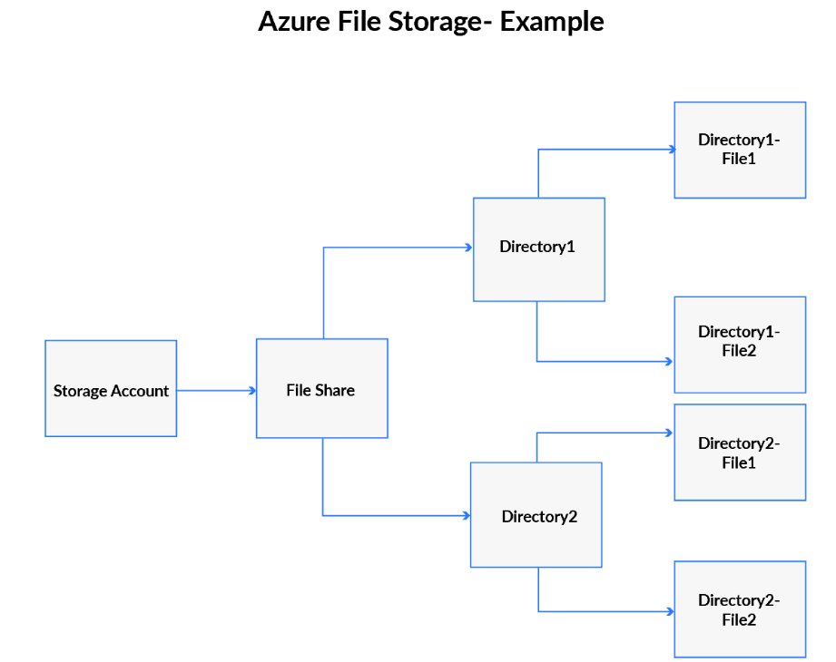
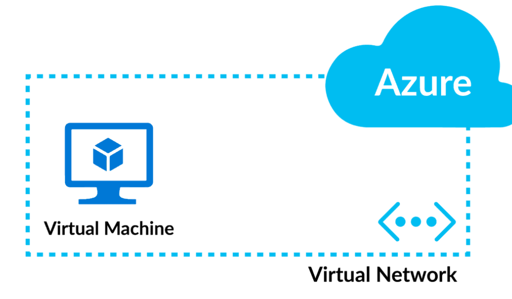
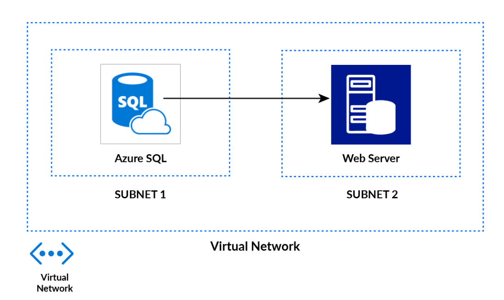

creating vm ss

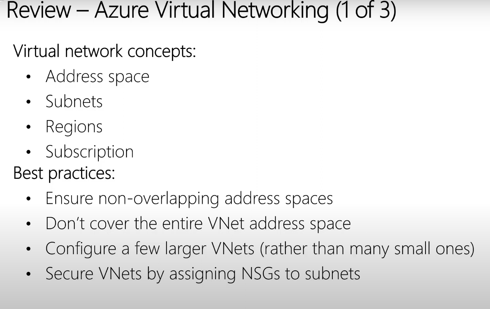

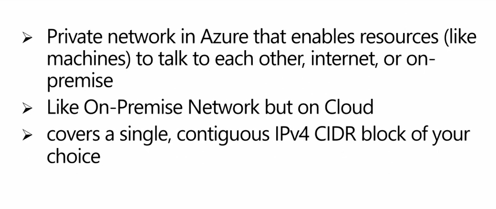

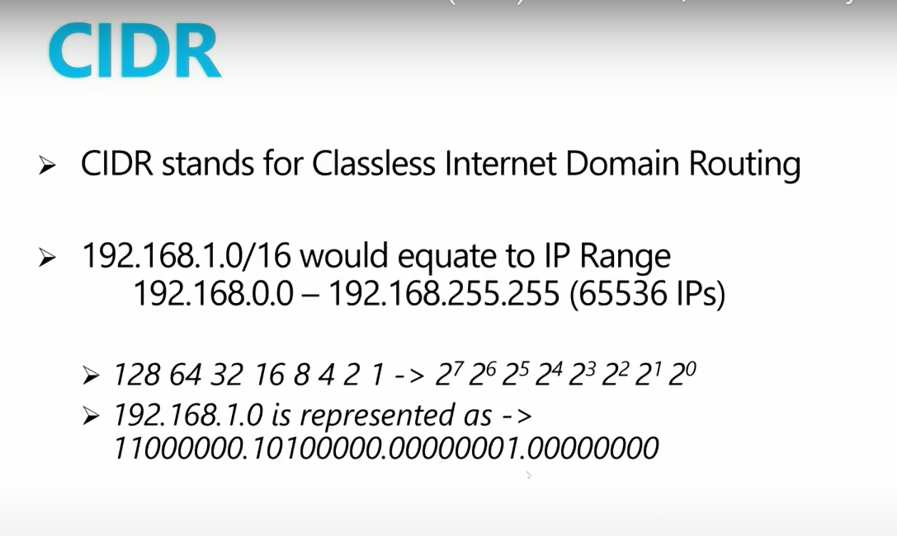

create
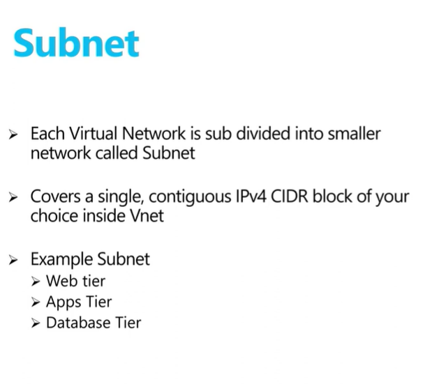

goto resource
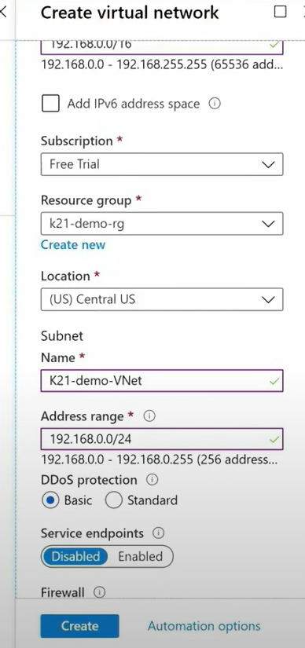

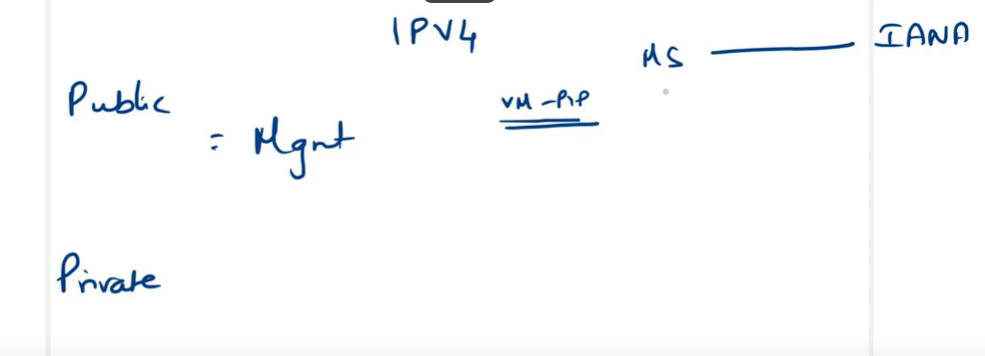

to delete the rg 

hibernation?

Availability zone
Fault domain
update domain

#Load Balancer
Azure front door
Traffic Manager
Application gateway
Load Balancer

# Networking
2.subnet ()
peering 
types of network

