**Cloud computing** is a way to get **IT services** like **computing
power**, **storage**, and **databases** over the internet, paying only
for what you use. Instead of buying and maintaining **physical data
centers** and **servers**, you can access these services from various
providers. To start learning cloud computing, you can choose from
popular providers such as **Amazon Web Services (AWS)**, **Microsoft
Azure**, **Google Cloud Platform (GCP)**, or **Oracle Cloud**.

**What is Traditional Architecture?**

Traditional IT infrastructure comprises **physical hardware and software
components**, including data centers, servers, networking hardware, and
enterprise applications. Maintaining such an infrastructure involves
significant costs and challenges:

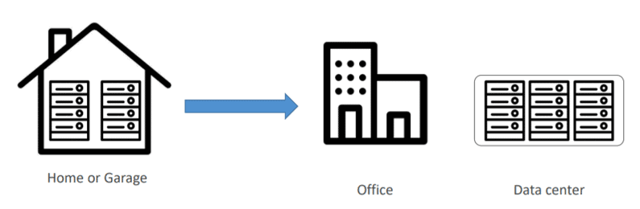

**Problems With Traditional Architecture**

-   Pay the rent for the **data center**

-   Pay for **power supply, cooling, and maintenance**

-   **Adding and replacing hardwar**e takes time

-   **Scaling** is limited

-   Hire a **team to monitor the infrastructure**

-   How do you deal with **disasters?** (earthquake, power shutdown,
    fire)

**What is Cloud Computing?**

The term '**cloud computing**' refers to the technology that makes the
cloud work. This includes some form of** virtualized IT
infrastructure---servers**, operating system software, networking, and
other infrastructure that's abstracted using special software so that it
can be pooled and divided irrespective of physical hardware boundaries.
For example, a single hardware server can be divided into multiple
servers.

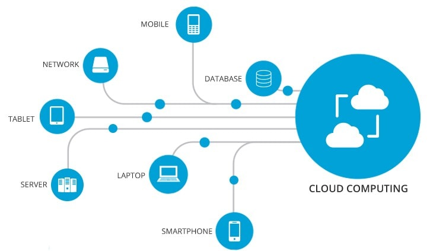

**How Does It Overcome the Problems of Traditional Architecture?**

-   **Lower IT costs:**

The cloud helps you to **offload some or most of the costs and
effort** of purchasing, installing, configuring, and managing your own
on-premises infrastructure.

-   **Improve agility and time-to-value: **

With the help of the cloud, your organization can **start using
enterprise applications within a minute**, instead of waiting weeks or
months for IT to respond to a request, purchase and configure supporting
hardware, and install the software. It also lets you **empower certain
users, specifically developers and data scientists**, to help themselves
with software and support the infrastructure.

-   **Scale more easily & cost-effectively:**

As the cloud provides elasticity, instead of purchasing the excess
capacity that **sits vacant when it is no longer required**, you
can **scale capacity up or down in response to spikes and dips in
traffic**.

**Characteristics Of  Cloud Computing**

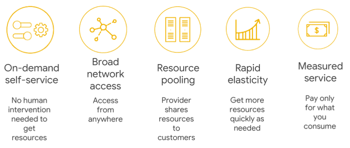

**On-Demand Self-Service:** Cloud services **do not require any human
administrators or intervention**; the users themselves can **provision
and manage computing resources** as needed.

**Broad Network Access: **Computing services are generally
provided **over standard networks and heterogeneous devices**.

**Resource Pooling:** The IT resources (e.g., Compute, Networks,
Storage, Applications, and Database services) present are **shared
across multiple applications and occupants** in an uncommitted
manner. **Multiple clients are provided service from the same physical
resource**.

**Rapid Elasticity:** The IT resources (e.g., Compute, Networks,
Storage, Applications, and Database services) present are **shared
across multiple applications and occupants** in an uncommitted
manner. **Multiple clients are provided service from the same physical
resource**.

**Measured Service: **The **resource utilization is tracked and
monitored** for each application and occupant; it will provide both the
user and the resource provider with **accountability for what has been
used**. This is done for various reasons, like **monitoring billing,
security concerns, and effective use of resources**.

**Why Cloud?**

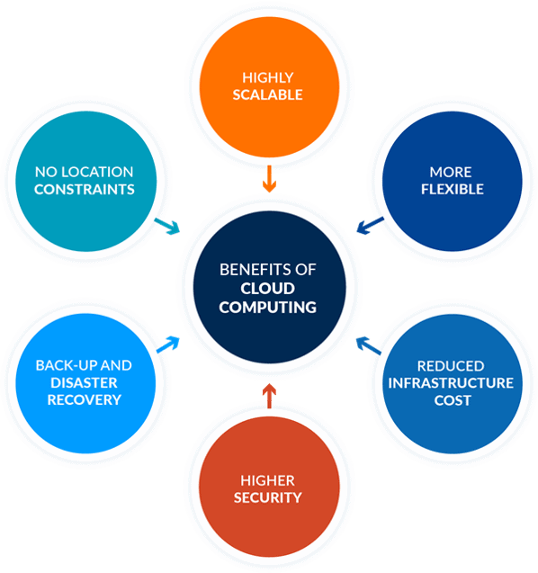

**Highly Scalable**

You can** scale up or scale down your operation and storage** needs as
quickly as suits your situation, allowing flexibility as required.
Rather than purchasing or provisioning the expensive upgrades yourself,
your service provider can handle all this for you. Using the cloud will
help you free up your time so you can get on with running your business.

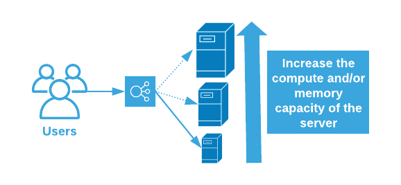{width="6.033333333333333in"
height="2.7916666666666665in"}

**More Flexible**

Offers businesses more flexibility overall versus hosting on a local
server. And **if you need extra bandwidth, then a cloud-based service
can meet your requirements instantly**, rather than undergoing a complex
(and expensive) update to your IT infrastructure.

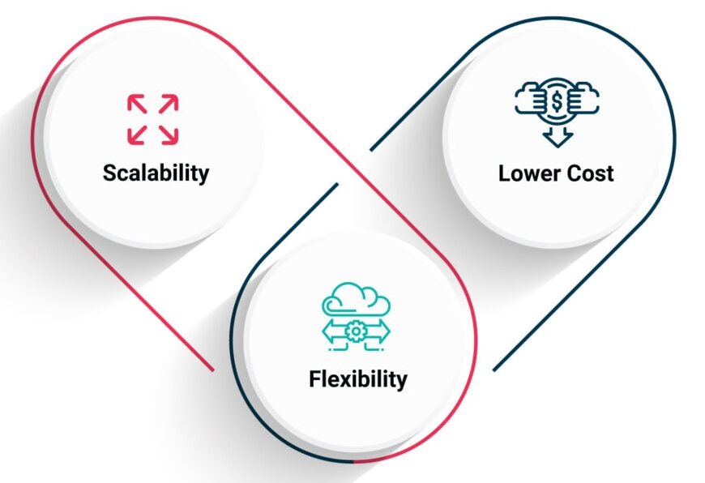

**Reduced Infrastructure Cost**

Moving to the cloud may **reduce the cost of managing and maintaining
your IT systems**. Rather than purchasing expensive assets and equipment
for your business, you can reduce your costs by using the resources of
your cloud service provider. You may be able to reduce your operating
and management costs because:

-   The cost of system upgrades and new hardware and software may be
    included in your contract.

-   There is no need to pay wages for expert staff

-   Your energy consumption costs may be reduced

-   There are fewer time delays.

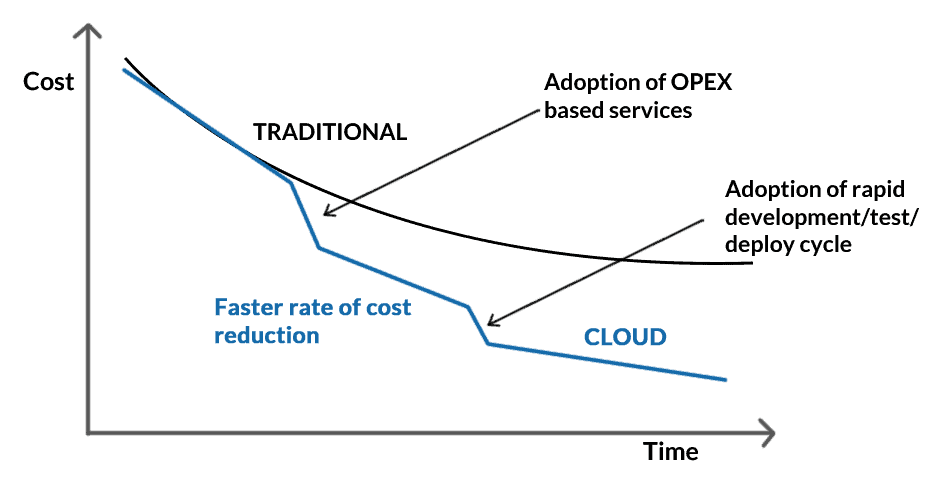

**Higher Security**

For many cloud customers, security is a priority. Users will buy more
than in traditional environments, based on their reputations for their
integrity, confidentiality, and resilience, as well as the safety
services of their providers. This **remains a strong incentive to
enhance security best practices and compete in security** for cloud
providers.

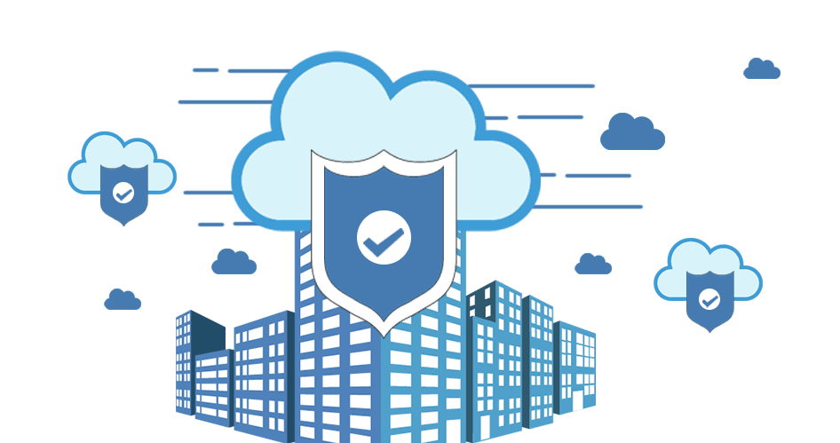

**High Availability**

The term High Availability refers to a system (a network, a server array
or cluster, etc.) that is **designed to avoid loss of service by
reducing or managing failures and minimizing planned downtime**. In an
organization, the system is expected to be highly available when life,
health, and well-being, including economic well-being, are at stake.

**Disaster Recovery**

One of the factors that contributes to the **success of a business is
controlling the resources.** Unfortunately, no matter how in control
your organization is, maybe when it comes to its processes, there will
always be things that are completely out of your control, and the
downtime in your services leads to lost productivity, revenue, and
organizational reputation, so there is something you can do to help
speed up your recovery. Cloud services provide quick data recovery for
all kinds of emergency scenarios, from natural disasters to power
outages.

**Fault Tolerance**

**Fault tolerance** is the capacity of a system or service to carry on
without interruption or performance deterioration, even if one or more
instances or components malfunction. The objective is to guarantee high
service availability and dependability in the event of network outages,
software bugs, hardware malfunctions, or other unforeseen challenges.

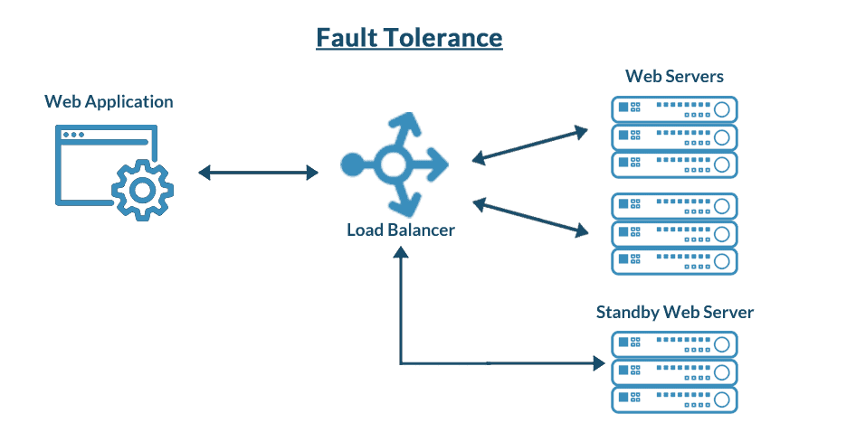

**No Location Constraints**

You can access your data from home, the office, or any other location
(providing you have an internet connection). If you need access to your
data while you are off-site, you can connect to your virtual office
quickly and easily.

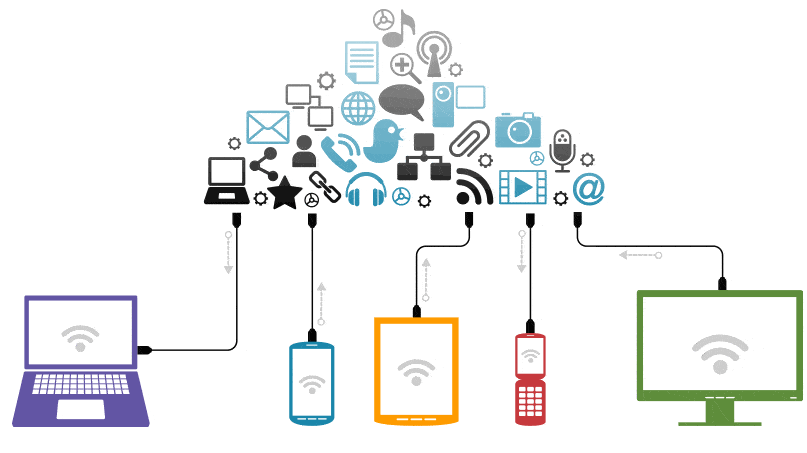

**Cloud Service Model**

There are three types of service models. Each type of cloud computing
provides different levels of control, flexibility, and management,
so you'll select the proper set of services for your needs. The** three
service models **are as follows:
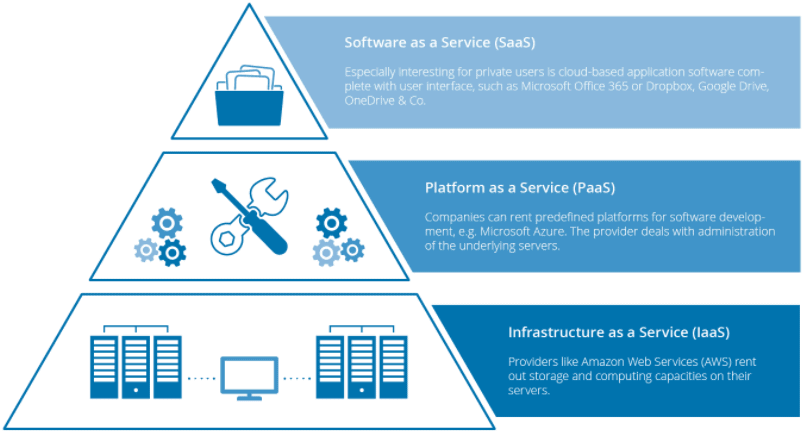

**Infrastructure As A Service (IaaS)**

-   It is the** most flexible** type of service which lets you rent the
    hardware and contains the basic building blocks for cloud and IT.

-   **It gives you complete control over the hardware** that runs the
    application (servers, VMs, storage, networks & operating systems).

-   IaaS gives you the very best level of flexibility and management
    control over your IT resources.

-   **Examples** of IaaS: VM or EC2 (from AWS), storage, or
    networking.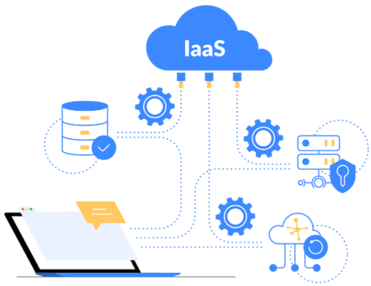

**Platform As A Service (PaaS)**

-   PaaS is a** service model** that provides a **ready-to-use
    development environment** where developers can specialize in writing
    and executing high-quality code to make customized applications.

-   PaaS will help you **create an application quickly without managing
    the underlying infrastructure**. For example, when deploying a web
    application using PaaS, you **don't have to install the OS, web
    server, or even system patching**. However, you can **scale the
    resources and add new features** to your services.

-   **Examples of PaaS**: **Elastic Beanstalk or Lambda from
    AWS**, **WebApps, Functions or Azure SQL DB from Azure**, **Cloud
    SQL DB from Google Cloud**, or **Oracle Database Cloud Service from
    Oracle Cloud**.\
    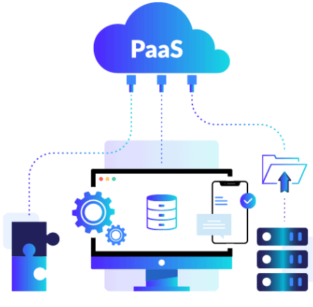

**Software As A Service (SaaS)**

-   SaaS provides you with a **complete product** that is **run and
    fully managed** by the **service provider**.

-   The **software is hosted online** and made available
    to **customers** on a **subscription basis or for purchase** in
    this **cloud service model**.

-   With a SaaS offering, you **don't need to worry about** how
    the **service is maintained** or how the **underlying
    infrastructure** is **maintained**. It would help if you **believed
    in how you'd use that specific software**."

-   Examples of SaaS: **Microsoft Office 365**, **Oracle ERP/HCM
    Cloud**, **SalesForce**, **Gmail**, or **Dropbox**.\
    

**Graphical Comparison of Cloud Computing Service Models**

**Which Cloud Service Model To Learn?**

One of the most common questions we get from our students is: **Which
Cloud Computing Service Model I should learn?**

-   So, if you are a System Administrator, you should learn
    both **Infrastructures as a Service (IaaS) and Platform as a Service
    (PaaS).** The reason is that whatever you are developing or
    deploying over Infrastructure as a Service, i.e., PaaS always runs
    on top of IaaS. That's the reason you should know both IaaS and
    SaaS.

-   If you are working as a consultant, like a financial consultant, or
    working on a packaged application such as SAP, HRMS, etc., then you
    should learn **Software as a Service (SaaS).**

**Cloud Deployment Model**

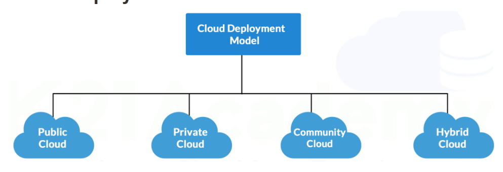

There are four primary** deployment
models**: **Public**, **Private**, **Community**, and **Hybrid Cloud**.
Each model offers different advantages and addresses the specific needs
of organizations based on their requirements
for **scalability**, **privacy**, **cost**, and **control**.

**Public Cloud**

This is accessible to the general public, offering services over the
internet on a **pay-per-use** basis. These services are managed by
third-party providers, which handle
the **infrastructure**, **maintenance**, and **security**.

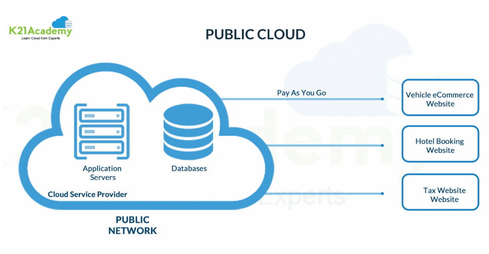

**Advantages:**

-   **Scalability**: Easily scale resources up or down based on demand.

-   **Cost-effective**: Pay only for what you use without the need for
    upfront capital expenditure.

-   **High Availability**: Providers typically ensure high uptime and
    reliability

**Limitations:**

-   **Security Concerns**: Shared infrastructure can pose security and
    privacy risks.

-   **Less Customization**: Limited control over infrastructure and
    services.

-   **Potential Outages**: Dependence on the provider's reliability can
    lead to service disruptions.

**Examples:** [Amazon web services
(AWS)](https://aws.amazon.com/free/), [Microsoft
Azure](https://azure.microsoft.com/en-in/free/), and [Google Cloud
Platform (GCP)](https://console.cloud.google.com/freetrial).

**Private Cloud**

This is dedicated to a single organization, offering greater control
over data, security, and compliance. It can be hosted **on-premises** or
by a third-party provider.

**Advantages:**

-   **Enhanced Security**: Resources are not shared with others,
    providing better data privacy.

-   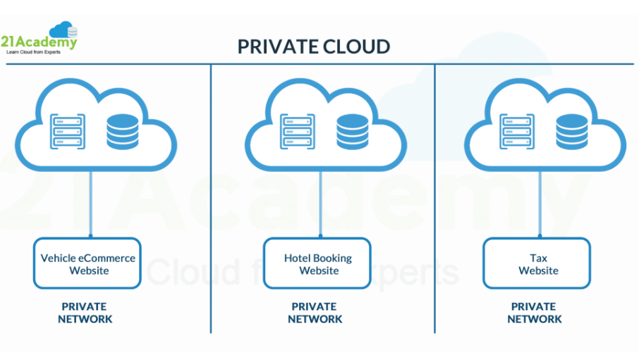

-   **Compliance**: Easier to comply with industry regulations and
    standards.

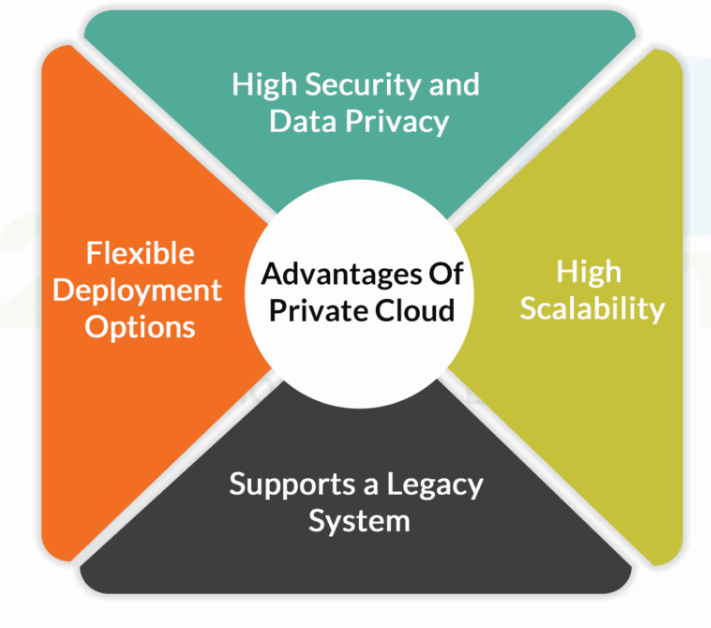

**Limitations:**

-   **Cost**: More expensive due to the need for dedicated hardware and
    maintenance.

-   **Maintenance**: Requires significant IT resources for setup and
    management.

-   **Fixed Scalability**: Limited by the physical resources available.

**Examples:** HP Data Centers, Microsoft, Ubuntu, and Elastra-private
cloud, etc.

**Community Cloud**

This serves a group of organizations with shared concerns (e.g.,
security, compliance, jurisdiction). It combines some benefits of both
private and public clouds.

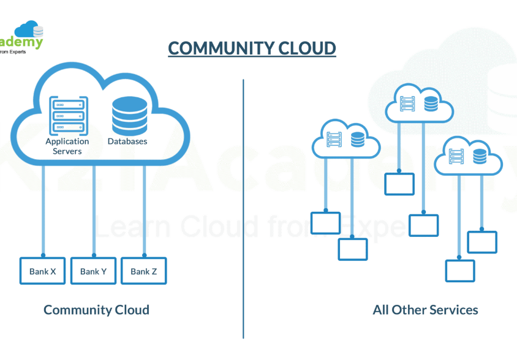

**Advantages:**

-   **Cost-sharing**: Infrastructure costs are shared among the
    organizations, reducing individual expenses.

-   **Enhanced Collaboration**: Facilitates collaboration between
    organizations with similar needs.

-   **Security and Privacy**: Better than public cloud due to limited
    access to the participating organizations.

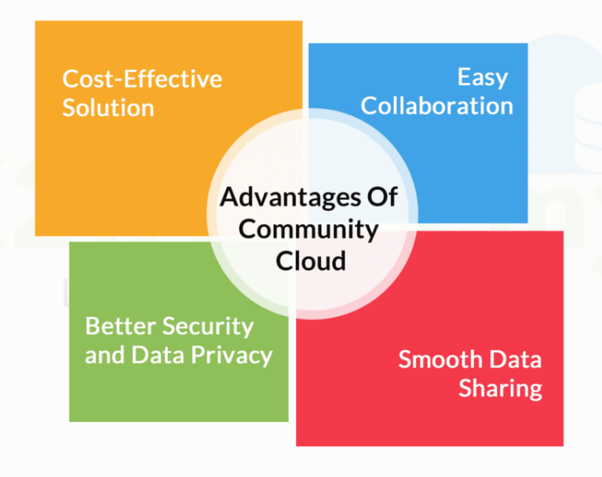

**Limitations:**

-   **Limited Usage**: Not as widely adopted or supported as public and
    private clouds.

-   **Higher Costs**: More expensive than public clouds due to
    specialized requirements.

-   **Complex Management**: Requires coordination among multiple
    organizations.

**Hybrid Cloud**

This integrates public and private clouds, allowing data and
applications to be shared between them. This model offers flexibility
and balance between the two environments.

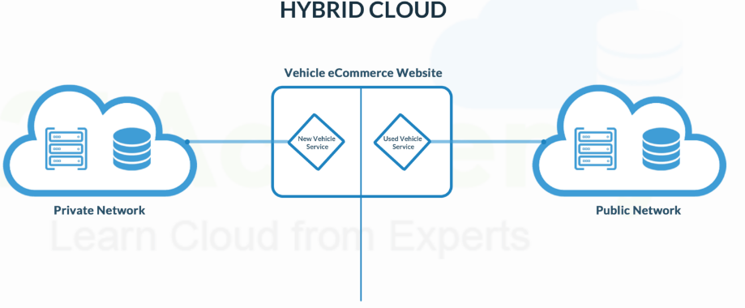

**Advantages:**

-   **Flexibility**: A mix of public and private clouds allows for
    optimized workload placement.

-   **Cost Efficiency**: Critical workloads can run on the private cloud
    while less-sensitive tasks utilize the public cloud.

-   **Scalability**: Easily scale workloads across cloud environments
    based on demand.

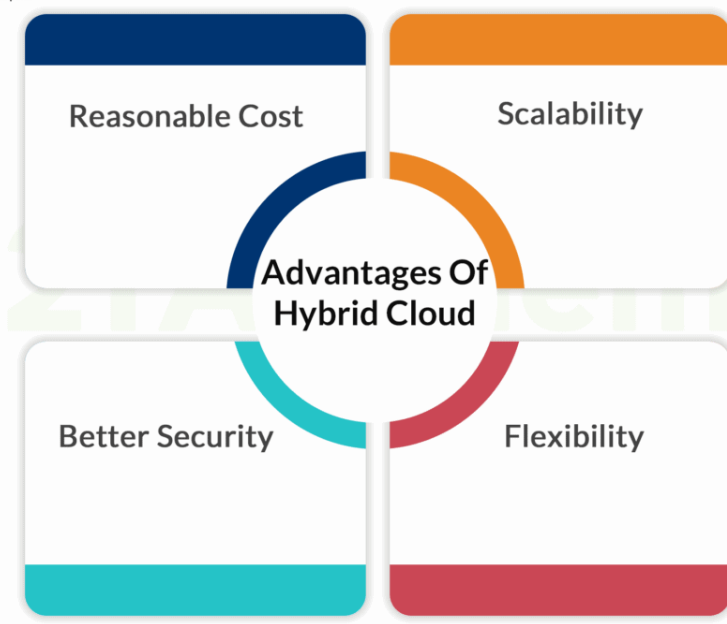

**Limitations:**

-   **Complex Integration**: Requires careful management and integration
    between different cloud environments.

-   **Security**: Potential security challenges due to data transfer
    between public and private clouds.

-   **Management Overhead**: Requires robust management tools and
    practices to handle hybrid environments.

**Examples:** Oracle Cloud at Customer, Google Cloud Anthos, AWS
Outpost, Microsft Azure Stack.

The primary benefit of this **hybrid cloud** is the functionality of
services available to clients, such as multiple types of **deployment
models**. The **Hybrid Cloud Model** is growing in demand and popularity
as more businesses have adopted **cloud solutions** as a primary part of
their **business model** with technology

**How To Choose Between Them?**

Selecting the right **deployment model** depends on several factors:

-   **Scalability**: If rapid scalability is required, consider public
    or hybrid clouds.

-   **Security and Privacy**: For highly sensitive data, private or
    community clouds are preferable.

-   **Cost**: Public clouds are generally more cost-effective for
    non-sensitive data and dynamic workloads.

-   **Compliance**: Industries with strict regulatory requirements might
    lean towards private or community clouds.

-   **Flexibility**: Hybrid clouds offer a balance, allowing
    organizations to utilize both private and public cloud advantages.

By understanding these **deployment models**, organizations can better
align their IT strategies with their business goals, ensuring
optimal **performance**, **security**, and **cost efficiency**.
