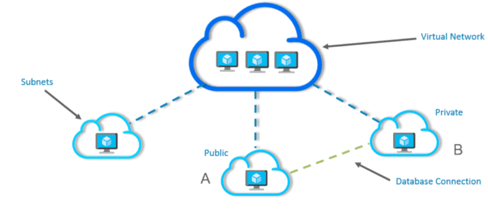
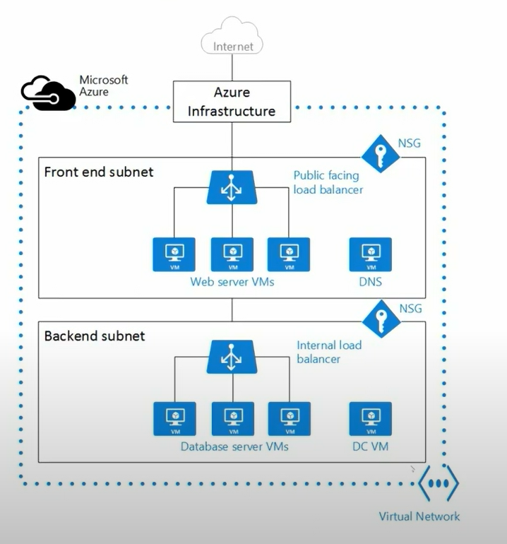
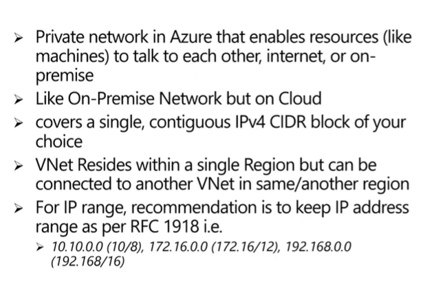
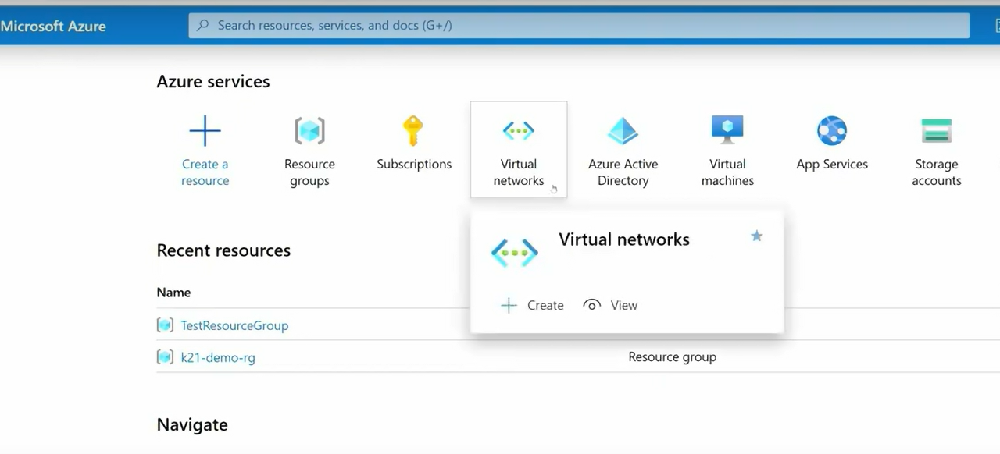
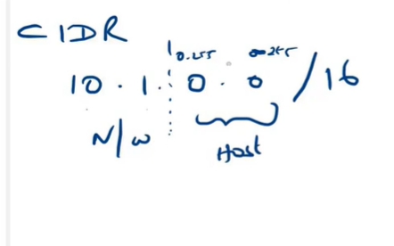
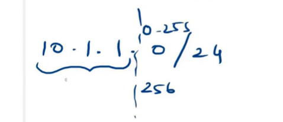
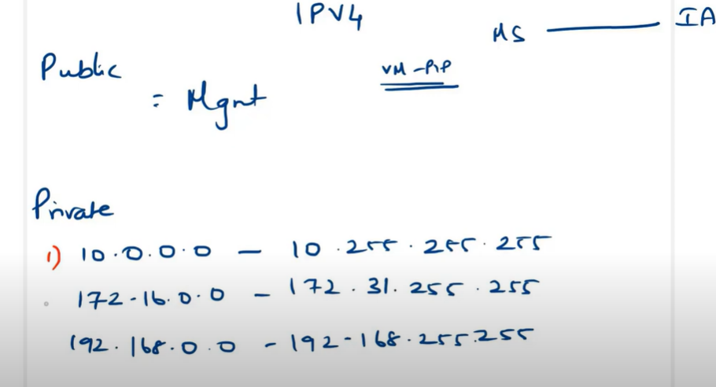
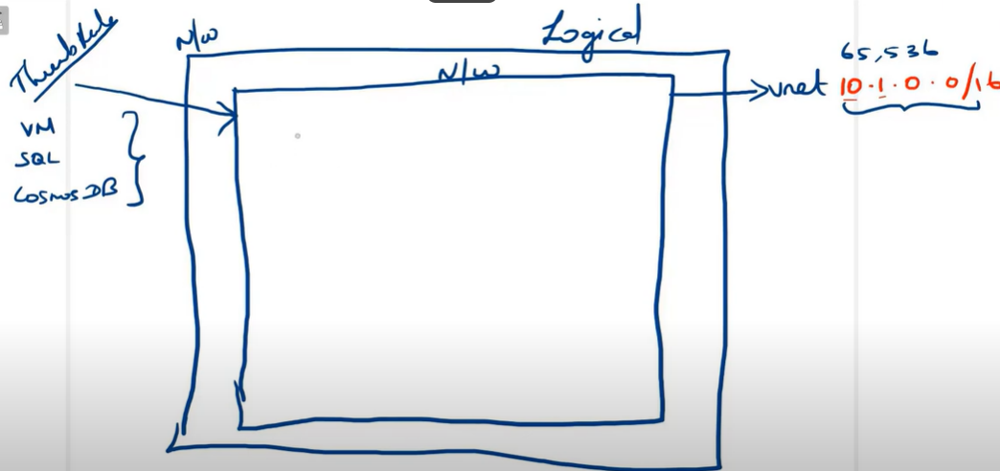
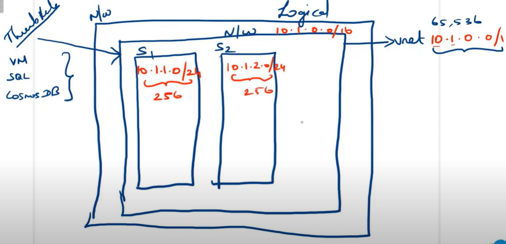
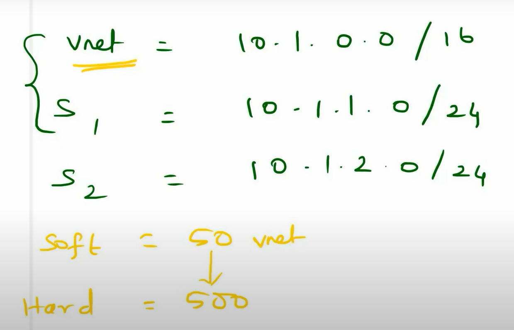

# What Is Virtual Network?
1. Azure Virtual Network (VNet) is the fundamental **building block for your private network** in Azure.
2. It enables many types of Azure resources, such as Azure Virtual Machines (VM), to securely communicate with each other, the internet, and on-premises networks.
3. It is similar to a traditional network that you’d operate in your own data center but brings with it additional benefits of Azure’s infrastructure such as scale, availability, and isolation

# Use of Virtual Network?
The main purpose of Virtual Networks is to act as a **communication channel between resources launched in the cloud**. Why Virtual? Because there are no actual routers or switches in the cloud.

For example, if you launch a database server and a website server in the cloud, they would need a medium to interact. This medium of interaction is called a Virtual Network. 

# Virtual Network Key Components
Key components of Azure VNets, include:

1. **Subnets**: Subnets enable segmenting a virtual network into one or more subnet networks and allocating a portion of the virtual network addresses space to each subnet. Azure resources are deployed to a specific subnet that is segmented using VNet address space. A subnet can further be divided into:

- Private Subnet – A network in which there is no internet access.
- Public Subnet – A network in which there is internet access.
  
  
  

  

  

  # CIDR

  IP4 => 32 bit
   each class takes 8 bit
   192.168.1.0/24
   
  192.168.1.0/16
   
  

  

  

  

  

  
  

  

  

  

  127 is missong ==>loopback ip address(or) home network ==>

  

  

  

  

  IANA ==>

  

  

  

  

  

